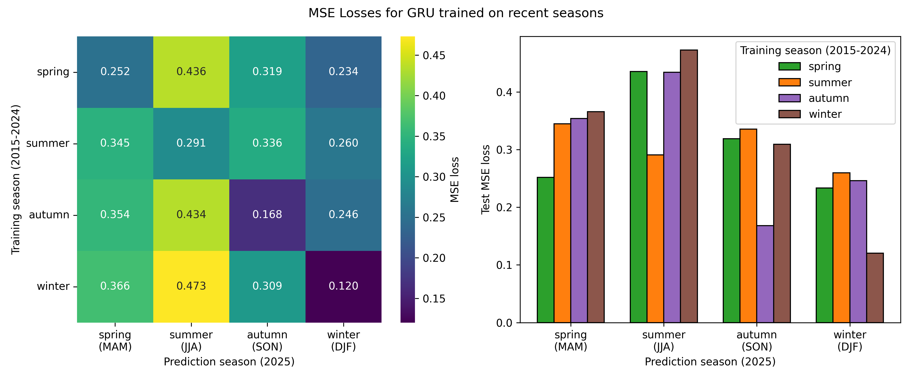

# Predicting the Future
## Machine Learning Weather Prediction Project
in the Course Applied Machine Learning (Troels Petersen), 2026, University of Copenhagen
Mailin, Katerina, Vasilis, Peter Resch

## Aim
Building ML models to predict a forecast vector from a timeseries and find out which variables are important for precipitation.

## Data used
ERA5 (https://cds.climate.copernicus.eu/datasets/reanalysis-era5-pressure-levels?tab=overview)

## Results

topics/training on wrong season - Peter/images
